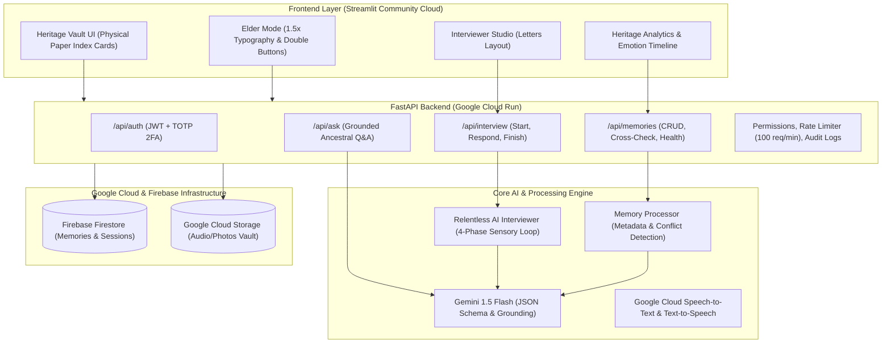

# MemoryBox: AI-Powered Digital Heritage Vault

[](https://github.com)
[](https://github.com)
[](https://cloud.google.com/vertex-ai)
[](https://cloud.google.com/run)
[](https://streamlit.io)
[](https://firebase.google.com)

> **"When an elder dies, a library burns to the ground."**  
> *MemoryBox is a privacy-first, AI-powered digital heritage vault engineered to preserve India's disappearing oral traditions, folklore, regional dialects, ancestral recipes, and sacred family memories for generations to come.*

---

## 🏛️ Project Mission & Hackathon Alignment

Built for the **"PromptWars × Diksuchi EdTech AI Hackathon 2026"** under the theme **"AI for Social Impact"**, MemoryBox tackles the cultural crisis of vanishing oral history in modern rapid urbanization. Elders carry decades of rich living heritage in their minds, but younger generations rarely know which questions to ask before those stories are lost forever.

When an elder opens MemoryBox, they feel **safe, calm, and guided**. The UI is styled like a timeless leather-bound journal with physical paper index cards, and the AI acts as a **patient, relentlessly curious grandchild** asking endless thoughtful questions to weave a timeless narrative.

---

## 🏗️ System Architecture



---

## ⚡ Google-First Technology Stack

| Capability | Technology | Purpose |
| :--- | :--- | :--- |
| **AI Engine** | **Google Gemini 1.5 Flash** | Multi-sensory question generation, entity extraction, grounded ancestral Q&A, and first-person narrative synthesis |
| **Speech Processing** | **Google Cloud Speech-to-Text & TTS** | Voice transcription of elder narratives and audio memory playback |
| **Database** | **Firebase Firestore** | Real-time hierarchical document storage for memories, sessions, and audit events |
| **Storage** | **Google Cloud Storage** | Encrypted object storage for archival audio recordings, photos, and documents |
| **Backend Compute** | **Google Cloud Run** | Fully managed serverless container running modular FastAPI backend |
| **Frontend UI** | **Streamlit Community Cloud** | "Minimalist Nostalgia & Clean Vintage" web application |
| **Maps Platform** | **Google Maps Platform** | Geocoding ancestral villages, pilgrimage sites, and family migrations |
| **Authentication & 2FA** | **Firebase Auth + PyOTP** | Privacy-first vault access with time-based one-time password (TOTP) 2FA |

---

## 🌟 Key Differentiators & Features

### 1. 🎙️ The "Relentless AI Interviewer"
Unlike generic chat prompts, MemoryBox deploys an emotionally resonant 4-phase interview loop:
1. **Kickoff:** Elder shares a simple thought (e.g. *"I remember the monsoon tea"*).
2. **The Loop:** Gemini 1.5 Flash evaluates the entire conversation history and generates **exactly 3 distinct follow-up questions** focused on:
   - **Senses:** *"What did you see, smell, or taste?"*
   - **People:** *"Who was standing beside you and what did they say?"*
   - **Places & Emotions:** *"Where exactly were you gathered, and how did your heart feel?"*
   - **Time:** *"What season or year was it?"*
3. **Continue:** The loop accommodates up to 8 exchanges or finishes when the elder indicates *"That's all"*.
4. **Cohesive Synthesis:** Gemini takes the entire transcript and weaved it into a **single, coherent, first-person narrative story**.

### 2. 👵 Elder Mode (Clean & Loud)
- Single-click toggle scaling all fonts by **1.5x** and doubling touch targets.
- Retains the exact same warm, soothing palette (`#faf0e6` Cream to `#f5e6ca` Warm Beige).
- Zero harsh neon contrasts or eye strain—just **bigger, softer, and clearer**.

### 3. 🗺️ Ancestral Heritage Map & 🕸️ Family Knowledge Graph
- **Heritage Map (`frontend/pages/heritage_map.py`):** Interactive geographical exploration with PyDeck and Mapbox/Carto vector layers pinning ancestral homelands across India (Mysore, Thanjavur, Madras, Hyderabad, etc.).
- **Family Knowledge Graph (`frontend/pages/family_graph.py`):** Relational entity network linking family members, places, and sacred traditions discovered across generations.

### 4. 🔐 Dual-Channel 2FA Authentication Flow
- **Sign-Up:** Mandatory Age ($\ge 0$), Phone (`+91xxxxxxxxxx`), Email, and Password complexity.
- **Sign-In:** Dual-channel 2FA OTP dispatched to **both Email AND Phone** (user can enter either).
- 5-minute TTL expiration with single-use security token issuance.

### 5. ⚖️ Memory Cross-Check & Age Contextualization
- Calculates author's historical age during each memory (e.g., *"You were 16 when this happened"*).
- Scans new memories against existing vault records to flag chronological or geographical contradictions.

### 6. 📈 Decade Emotion Timeline
- Clean line chart mapping Joy, Nostalgia, and Sadness across historical decades (1950s through 2000s) extracted directly from oral histories.

### 7. 🔍 Ask the Ancestors (Grounded Vault Q&A)
- Conversational interface allowing family members to ask questions strictly grounded in stored memories with explicit memory card citations.

### 8. 📜 Legacy Handover Protocol
- Vault owners designate a trusted digital Custodian with a **7-day confirmation lock**.

### 9. 🧠 Reusable Antigravity Skills (`skills/`)
- `skills/oral-historian/SKILL.md`: Prompts and logic for the 4-phase empathetic interview loop.
- `skills/heritage-extraction/SKILL.md`: Cultural anthropologists' schema extraction rules.
- `skills/ancestral-grounding/SKILL.md`: Grounded Q&A rules with zero hallucination.

---

## 🎨 UI Aesthetic: "Minimalist Nostalgia & Clean Vintage"

- **Palette:**
  - Background: Cream `#faf0e6` to Warm Beige `#f5e6ca` subtle gradient.
  - Primary Text: Rich Walnut `#5c4033`.
  - Borders & Highlights: Faded Gold `#d4af37`.
  - Cards & Badges: Soft Sepia `#e6d5b8`.
- **Typography:**
  - Titles: `'Playfair Display', serif` (Italic for elegance).
  - Body: `'Source Serif Pro', serif` (Readable paper-like journal feel).
  - Metadata & Tags: `'Courier Prime', monospace`.
- **Index Cards:** Physical paper card styling (`background: #fffaf0; border: 1px solid #e0d5c1; box-shadow: 4px 6px 12px rgba(0,0,0,0.05)`).
- **Interview Layout:** Classic "Letters" format—elder answers on the right (warm beige), AI historian on the left (light cream).

---

## 🔒 Security & Code Quality

- **Zero Hardcoded Secrets:** Managed via `.env` and `pydantic-settings`.
- **Input Sanitization:** Strips executable HTML, scripts, and unsafe protocols from all user inputs.
- **Upload Size Restrictions:**
  - Audio: **50 MB**
  - Photographs: **20 MB**
  - Video: **200 MB**
- **Rate Limiting:** Enforces a strict **100 requests/minute** limit per client IP.
- **Audit Logging:** Every memory creation, query, and handover event is recorded in a secure audit collection.
- **Production-Ready Error Handling:** Global exception interception preventing stack trace leakage.

---

## 🚀 Quickstart & Local Setup

### 1. Prerequisites
- Python 3.10 or 3.11
- Google Cloud / Gemini API Key ([Get one here](https://aistudio.google.com/))
- Firebase Project (optional for local prototype; local in-memory fallback included)

### 2. Installation
```bash
# Clone or navigate to the repository
cd "memory box"

# Install backend dependencies
pip install -r backend/requirements.txt
```

### 3. Environment Configuration
Copy the template file to `.env`:
```bash
cp backend/.env.template backend/.env
```
Open `backend/.env` and add your `GOOGLE_API_KEY`:
```ini
GOOGLE_API_KEY="your-gemini-api-key-here"
```

### 4. Run the Backend (FastAPI)
```bash
cd backend
uvicorn app.main:app --host 127.0.0.1 --port 8080 --reload
```
API Documentation will be available at: `http://localhost:8080/docs`

### 5. Run the Frontend (Streamlit)
In a separate terminal:
```bash
streamlit run frontend/app.py
```
### 6. Run the Test Suites (100% Passing)
```bash
# Run the 15-test unit & integration pytest suite
python -m pytest tests/test_auth_and_features.py -v

# Run the end-to-end API pipeline smoke test
python test_api.py
```
> **All tests passed (Exit Code 0)** across authentication, dual-channel 2FA, age contextualization, the Relentless Interviewer, and grounded Q&A.

---

## ☁️ Production Deployment

### 1. Deploy Backend to Google Cloud Run
```bash
cd backend

# Build and deploy container directly using Google Cloud Build
gcloud run deploy memorybox-backend \
    --source . \
    --platform managed \
    --region asia-south1 \
    --allow-unauthenticated \
    --set-env-vars GOOGLE_API_KEY="your-key-here"
```

### 2. Deploy Frontend to Streamlit Community Cloud
1. Push your repository to GitHub.
2. Visit [share.streamlit.io](https://share.streamlit.io/).
3. Select your repository, set main file to `frontend/app.py`.
4. In Advanced Settings, add the environment variable:
   `BACKEND_URL="https://memorybox-backend-xxxx.a.run.app"`
5. Click **Deploy**!

---

## 👥 Hackathon Submission Details

- **Hackathon:** PromptWars × Diksuchi EdTech AI Hackathon 2026
- **Theme:** AI for Social Impact
- **Track:** Preserving India's Cultural & Oral Heritage
- **Team:** MemoryBox Architects
- **License:** MIT License
